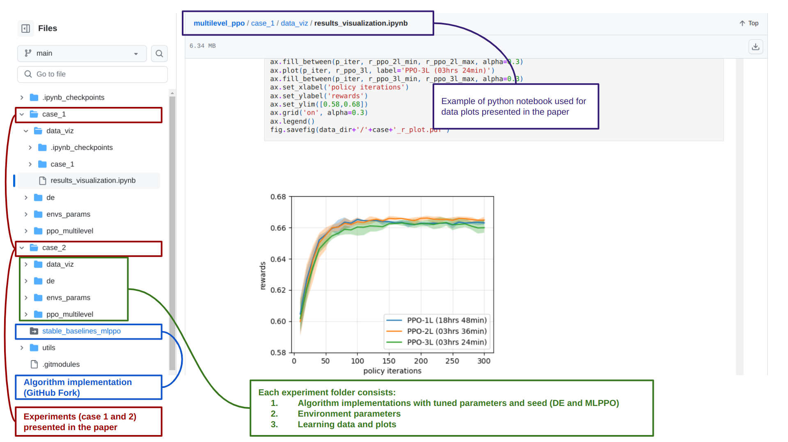

It's surprising to see how many research papers in reinforcement learning (RL) lack reproducibility in their implementation. Alarmingly, this issue persists even in high-ranking machine learning journals, which are often essential for securing positions in leading AI companies. This problem seems to stem from the immense pressure in academia to publish frequently, as it is a key factor for career advancement. However, this practice has significant negative consequences:

1. **Reduced Reliability**: It undermines the credibility of prestigious journals.
2. **Research Confusion**: It leads to confusion among researchers who rely on these papers as a foundation for their work.
3. **Misguided Progress**: It can steer the field in a false direction, hindering genuine advancements.

Given these concerns, I want to emphasize the critical importance of reproducibility in research. To illustrate, I'll share an example from my recent paper, where I introduced an algorithm called Multilevel PPO.

Reinforcement learning (RL) is fundamentally a stochastic optimization method used to solve optimal control problems. It leverages both exploration and exploitation techniques during the parameter (i.e., trajectory) search. Consequently, RL results are highly dependent on the random seeds used during execution. Additionally, RL algorithms have numerous tunable parameters that significantly impact the results. The choice of environments and their parameters further introduces variability into the outcomes. Therefore, it is crucial to specify all this information accurately in research papers to ensure reproducibility and reliability of the findings.
    

### Algorithms and Baselines

Many reinforcement learning (RL) papers aim to introduce novel methodologies by proposing new algorithms. A common practice is to compare these new methods with pre-existing algorithms, known as baselines. The parameters used in both the proposed algorithms and the baselines are often detailed in the appendices. However, this is frequently not an exhaustive list. A better practice would be to provide two separate GitHub repositories: one for the algorithm implementation and another for running the comparative experiments using the algorithm and the baselines.

In my paper on Multilevel PPO algorithms, the implementation is available in this repository: [GitHub Fork: stable-baselines3](https://github.com/atishdixit16/stable-baselines3). The execution of the algorithm and the baselines can be found in a separate repository: [Multilevel PPO](https://github.com/atishdixit16/multilevel_ppo).

### Environments

RL papers often demonstrate their methods on a variety of environments. These can be standard benchmark environments (e.g., OpenAI Gym, PettingZoo, or Atari games) or custom environments designed specifically for the paper. The parameters of these chosen environments significantly impact the results. It is crucial to provide detailed information about these parameters in the GitHub repositories, rather than only mentioning them in the paper. In my repository, I include two separate folders (case1 and case2) for each environment used in the paper. The environment parameters are specifically detailed in the env_params folder.

### Results and Data Visualizations

Often, result plots are created offline using data generated by the proposed methods. In my opinion, these should also be included in the provided code repositories. For example, in my data repository called data_viz, I include Python notebooks with scripts for generating the plots used in the paper.

### Seeds

Finally, and most importantly, the seeds used in the algorithms should be specified in the implementation. I often observe that in many algorithm executions (if they are provided), seeds are selected automatically using a random process. This practice defeats the purpose of having a seed. If the seeds themselves are chosen randomly, it becomes even harder to reproduce the results accurately. Specifying the seeds explicitly is essential for true reproducibility.
    
